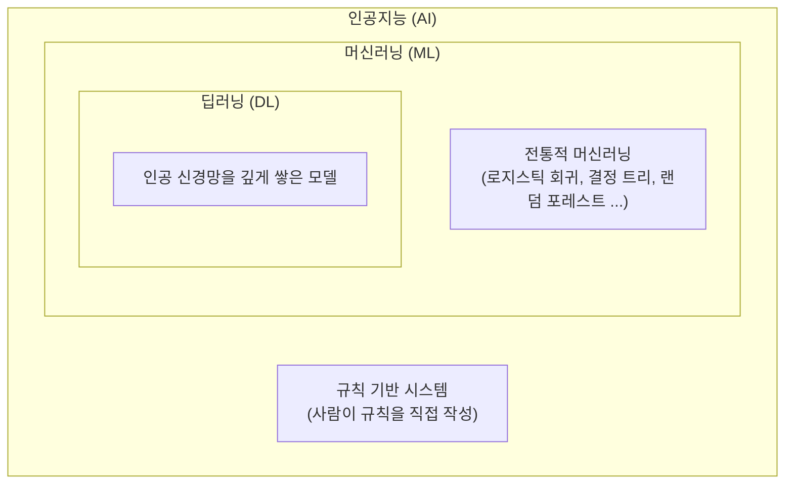

# 인공지능 · 머신러닝 · 딥러닝 / 지도 학습 · 비지도 학습

> 2026-10-09 · 정리 주제: ① 인공지능, 머신러닝, 딥러닝의 관계 및 개념 ② 머신러닝의 지도 학습과 비지도 학습의 차이

## 목차

- [1. 인공지능 · 머신러닝 · 딥러닝](#1-인공지능--머신러닝--딥러닝)
- [2. 지도 학습 vs 비지도 학습](#2-지도-학습-vs-비지도-학습)

---

# 1. 인공지능 · 머신러닝 · 딥러닝

## 1-1. 한 그림으로 보는 관계

세 개념은 서로 다른 기술이 아니라, **큰 범위 안에 작은 범위가 들어 있는 포함 관계**다.



> **인공지능 ⊃ 머신러닝 ⊃ 딥러닝**
>
> 딥러닝은 머신러닝의 한 종류이고, 머신러닝은 인공지능을 만드는 방법 중 하나다.

## 1-2. 각각의 개념

| 구분 | 한 줄 정의 | 핵심 |
| --- | --- | --- |
| **인공지능 (AI)** | 사람의 지능(판단, 인식, 추론)을 흉내 내는 **모든 기술** | 가장 넓은 개념. 규칙을 사람이 직접 짜는 프로그램도 포함 |
| **머신러닝 (ML)** | 사람이 규칙을 쓰지 않고, **데이터에서 규칙(패턴)을 스스로 찾게** 하는 방법 | 데이터 + 정답 → 모델이 규칙을 학습 |
| **딥러닝 (DL)** | **인공 신경망을 여러 층 깊게** 쌓아서 학습하는 머신러닝 | 특징(피처)까지 스스로 뽑아냄. 이미지, 음성, 글에 강함 |

## 1-3. 규칙 기반 프로그래밍 vs 머신러닝

머신러닝을 이해하는 핵심은 **"규칙을 누가 만드느냐"** 다.

```text
[전통적인 프로그래밍]   데이터 + 규칙(사람이 작성)  →  결과
[머신러닝]              데이터 + 결과(정답)         →  규칙(모델이 학습)
```

#### 예시 : 스팸 메일 분류

| 방식 | 하는 일 | 한계 |
| --- | --- | --- |
| 규칙 기반 | `if "무료" in 제목 or "당첨" in 제목:` 처럼 사람이 조건을 직접 작성 | 스팸 수법이 바뀌면 규칙을 계속 새로 써야 함 |
| 머신러닝 | 스팸/정상 메일 수천 개를 보여 주면 모델이 단어 패턴을 학습 | 데이터가 바뀌면 다시 학습만 하면 됨 |

> 자바에서 `if-else`를 직접 짜던 방식이 규칙 기반이고, 그 `if-else`를 **데이터를 보고 자동으로 만들어 주는 것**이 머신러닝이라고 생각하면 된다.

## 1-4. 머신러닝 vs 딥러닝

| 구분 | 머신러닝 (전통적) | 딥러닝 |
| --- | --- | --- |
| 피처(특징) | **사람이 직접 만든다** (피처 엔지니어링) | 모델이 **스스로 뽑아낸다** |
| 잘 맞는 데이터 | 표 형태 데이터 (CSV, DB) | 이미지, 음성, 텍스트 |
| 필요한 데이터 양 | 수천 ~ 수만 건으로도 가능 | 보통 매우 많이 필요 |
| 계산 자원 | CPU로 충분 | GPU가 필요한 경우가 많음 |
| 해석 | 비교적 쉬움 (피처 중요도 등) | 어려움 (블랙박스) |
| 예시 모델 | 로지스틱 회귀, 결정 트리, 랜덤 포레스트, KNN, SVM | CNN(이미지), RNN·트랜스포머(텍스트) |

#### 예시 : 온라인 쇼핑몰 주문 데이터

주문 시각과 금액만 있는 데이터에서, **"주문이 취소될지"** 예측에 도움이 될 만한 특징을 사람이 직접 만든다.

```python
import pandas as pd

df = pd.DataFrame({
    "order_time": pd.to_datetime(["2026-10-03 23:40", "2026-10-06 10:15", "2026-10-11 02:05"]),
    "price": [35000, 120000, 8000],
    "quantity": [1, 3, 2],
})

# 피처 엔지니어링 : 사람이 직접 '쓸 만한 특징'을 만든다 → 전통적인 머신러닝
df["hour"] = df["order_time"].dt.hour                      # 주문 시간대 (새벽 주문은 취소가 많을까?)
df["is_weekend"] = (df["order_time"].dt.weekday >= 5).astype(int)   # 주말 여부 (5=토, 6=일)
df["unit_price"] = df["price"] / df["quantity"]            # 개당 가격

print(df[["hour", "is_weekend", "unit_price"]])
#    hour  is_weekend  unit_price
# 0    23           1     35000.0
# 1    10           0     40000.0
# 2     2           1      4000.0
```

> 이런 피처를 사람이 고민해서 만드는 과정이 머신러닝의 핵심 작업이다.
>
> 딥러닝은 고양이 사진에서 "귀 모양", "수염" 같은 특징을 사람이 정의하지 않아도 신경망이 스스로 찾아낸다.

> [!TIP]
> 표 형태 데이터(매출, 주문 기록, 고객 정보처럼 CSV·DB에 담긴 데이터)는 딥러닝보다 **랜덤 포레스트, 그래디언트 부스팅 같은 전통적 머신러닝이 더 잘 맞는 경우가 많다.**
>
> 딥러닝이 무조건 더 좋은 것은 아니다.

---

# 2. 지도 학습 vs 비지도 학습

머신러닝은 **학습할 때 정답(레이블)을 주느냐**에 따라 크게 나뉜다.

## 2-1. 지도 학습 (Supervised Learning)

**정답이 있는 데이터**로 학습해서, 새 데이터의 정답을 맞히는 방법이다.
선생님(정답)이 옆에서 "이건 맞고 이건 틀렸어"라고 알려 주며 가르치는 것과 같다.

```text
입력(X, 피처)  +  정답(y, 레이블)  →  학습  →  새 입력의 정답을 예측
```

지도 학습은 **정답의 형태**에 따라 다시 두 가지로 나뉜다.

| 종류 | 정답 형태 | 예시 | 대표 모델 |
| --- | --- | --- | --- |
| **분류 (Classification)** | 정해진 **범주** 중 하나 | 스팸/정상, 합격/불합격, 대출 연체/정상 | 로지스틱 회귀, 결정 트리, 랜덤 포레스트, KNN, SVM |
| **회귀 (Regression)** | 연속된 **숫자** | 집값, 내일 기온, 시험 점수 | 선형 회귀, 랜덤 포레스트 회귀 |

#### 예시 : 공부 시간과 출석률로 합격 여부 예측 (분류)

```python
import pandas as pd
from sklearn.tree import DecisionTreeClassifier

# 학습 데이터 : 입력(X)과 정답(y)이 모두 있다
train = pd.DataFrame({
    "study_hours": [1, 2, 3, 5, 6, 8, 9, 10],
    "attendance":  [50, 60, 55, 80, 85, 90, 95, 92],     # 출석률(%)
    "passed":      [0, 0, 0, 1, 1, 1, 1, 1],             # 정답 : 0 = 불합격, 1 = 합격 (레이블)
})

X = train[["study_hours", "attendance"]]
y = train["passed"]

model = DecisionTreeClassifier(random_state=42)
model.fit(X, y)                  # 입력과 정답을 같이 준다 → 지도 학습

new = pd.DataFrame({"study_hours": [2, 7], "attendance": [58, 88]})
print(model.predict(new))        # [0 1] → 새 학생 2명의 합격 여부를 예측
```

#### 지도 학습의 평가

정답이 있으니 **예측과 정답을 비교해서 채점**할 수 있다.

| 분류 | 회귀 |
| --- | --- |
| 정확도, 정밀도, 재현율, F1, AUC, 혼동행렬 | MAE, MSE, RMSE, R² |

> [!WARNING]
> 불균형 데이터(예: 거래 1,000건 중 사기 거래 20건, 2%)에서는 **전부 정상이라고만 답해도 정확도가 98%** 나온다.
>
> 분류는 정확도만 보지 말고 재현율, F1, AUC를 함께 봐야 한다.

## 2-2. 비지도 학습 (Unsupervised Learning)

**정답이 없는 데이터**에서 모델이 스스로 **구조나 패턴**을 찾는 방법이다.
선생님 없이 "비슷한 것끼리 묶어 봐"라고만 하는 것과 같다.

```text
입력(X)만  →  학습  →  비슷한 것끼리 묶기 / 특징 줄이기 / 이상한 것 찾기
```

| 종류 | 하는 일 | 예시 | 대표 기법 |
| --- | --- | --- | --- |
| **군집화 (Clustering)** | 비슷한 데이터끼리 **그룹**으로 묶음 | 고객 세분화 (자주 쓰는 고객 / 가끔 쓰는 고객) | K-평균(K-Means), DBSCAN |
| **차원 축소** | 많은 피처를 **핵심 몇 개로 압축** | 피처 100개 → 2개로 줄여 그래프로 보기 | PCA |
| **이상 탐지** | 대부분과 **다른 데이터**를 찾음 | 카드 부정 사용, 장비 고장 징후 | Isolation Forest |

#### 예시 : 쇼핑몰 고객 군집화

```python
import pandas as pd
from sklearn.cluster import KMeans

# 정답(y) 없이 고객 정보(X)만 있다
customers = pd.DataFrame({
    "visits_per_month": [2, 3, 1, 15, 18, 20, 8, 9, 7],
    "avg_spend":        [10000, 12000, 8000, 30000, 28000, 35000, 150000, 140000, 160000],
})

kmeans = KMeans(n_clusters=3, random_state=42, n_init=10)
customers["group"] = kmeans.fit_predict(customers)   # 입력만 주고 3개 그룹으로 나눠 달라고 함

print(customers.groupby("group").mean().round(0))
#        visits_per_month  avg_spend
# group
# 0                  18.0    31000.0
# 1                   8.0   150000.0
# 2                   2.0    10000.0
```

> 결과로 나온 그룹 0, 1, 2가 각각 "자주 오는 고객", "한 번에 많이 사는 고객", "가끔 오는 고객"인지는 **사람이 그룹별 평균을 보고 해석**해야 한다. 모델은 이름을 붙여 주지 않는다.

## 2-3. 한눈에 비교

| 구분 | 지도 학습 | 비지도 학습 |
| --- | --- | --- |
| 정답(레이블) | **있음** (`y`) | **없음** |
| `fit()`에 넣는 것 | `model.fit(X, y)` | `model.fit(X)` |
| 목표 | 정답 **예측** | 숨은 **구조·패턴** 발견 |
| 대표 작업 | 분류, 회귀 | 군집화, 차원 축소, 이상 탐지 |
| 평가 | 정답과 비교해 채점 가능 | 정답이 없어 평가가 어려움 (해석 필요) |
| 데이터 준비 | 정답을 붙이는 데 **비용·시간이 큼** | 정답이 필요 없어 데이터 구하기 쉬움 |
| 예시 | 스팸 메일 분류, 집값 예측 | 고객 세분화, 이상 거래 탐지 |

## 2-4. 그 밖의 학습 방식 (참고)

| 방식 | 설명 | 예시 |
| --- | --- | --- |
| **준지도 학습** | 정답이 있는 데이터 **조금** + 정답 없는 데이터 **많이** | 일부만 사람이 라벨링한 의료 영상 |
| **강화 학습** | 정답 대신 행동의 결과로 **보상**을 받으며 학습 | 바둑 AI(알파고), 게임 AI, 로봇 제어 |

---

## ✅ 한 줄 요약

- **인공지능 ⊃ 머신러닝 ⊃ 딥러닝** — 포함 관계다
- 머신러닝은 사람이 규칙을 쓰는 대신 **데이터에서 규칙을 학습**한다
- 딥러닝은 신경망을 깊게 쌓아 **피처까지 스스로 뽑는** 머신러닝이다
- **지도 학습** = 정답(y)이 있음 → 분류(범주) / 회귀(숫자)
- **비지도 학습** = 정답이 없음 → 군집화 / 차원 축소 / 이상 탐지
- 코드로 구분하면 `fit(X, y)`는 지도 학습, `fit(X)`는 비지도 학습
